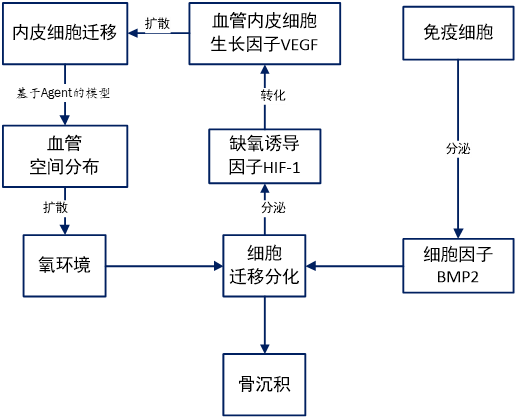
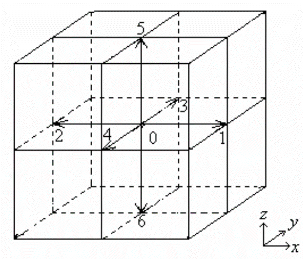
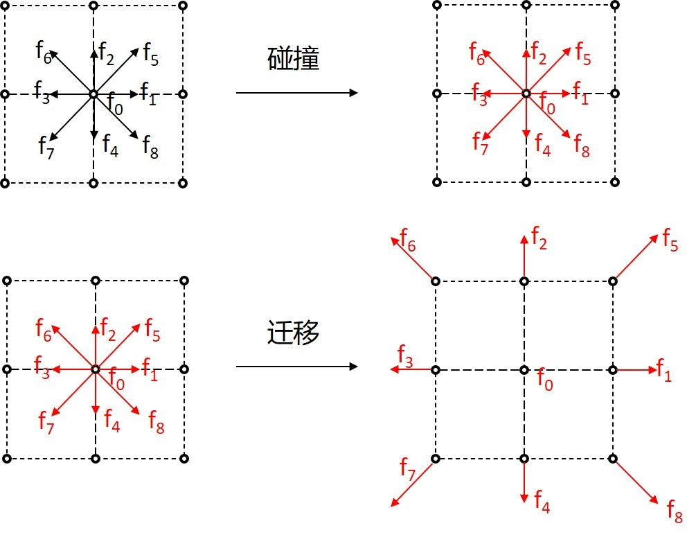
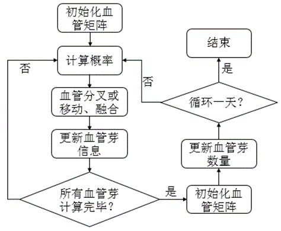
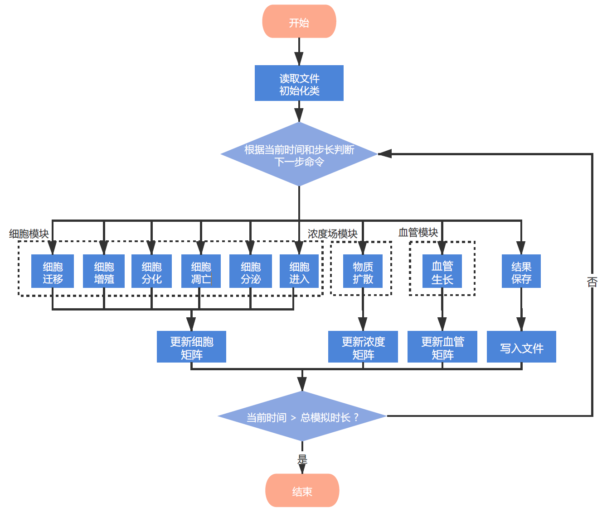

```html
<head>
    <script src="https://cdn.mathjax.org/mathjax/latest/MathJax.js?config=TeX-AMS-MML_HTMLorMML" type="text/javascript"></script>
    <script type="text/x-mathjax-config">
        MathJax.Hub.Config({
            tex2jax: {
            skipTags: ['script', 'noscript', 'style', 'textarea', 'pre'],
            inlineMath: [['$','$']]
            }
        });
    </script>
</head>
```

# 软件开发文档


## 一、软件简述

本项目提出了一个综合考虑多种影响因素和生物学过程的模拟方法，建立了一个连续-离散耦合的骨再生数学模型，耦合了多孔支架内免疫调控、细胞活动、血管生成、生长因子运输和氧扩散等过程，并在此基础上设计实现了便于与用户交互的设计软件。该软件通过对骨再生过程的模拟，计算结果可作为指导骨植入物结构设计的有力工具。


## 二、软件功能

本软件通过建立一个多尺度耦合的数学模型，描述骨再生过程中免疫调控、细胞活动、血管生长、物质扩散等过程，并基于 Qt 设计了易于操作的用户交互界面。

主要功能如下：

1）免疫调控：实现对免疫过程的模拟，可进行干扰素扩散等计算。

2）细胞活动：基于 Agent 模型，实现对细胞迁移、增殖、分化和凋亡等行为的模拟。

3）血管生长：基于 Agent 模型，实现对血管的移动、分支、融合和出芽等过程的模拟。

4）物质扩散：物质的扩散用扩散过程来描述，扩散方程通过玻尔兹曼格子法（LBM）进行计算。

5）界面：用户可通过此界面实现支架结构的可视化，以及对计算进度的监控。


## 三、模型原理

软件使用的模型是一个连续-离散耦合的多尺度模型，其中生长因子、氧浓度变化采用扩散方程描述，而细胞的各项活动和血管芽的迁移分叉采用基于  Agent 的模型描述。

该模型呈现在一个规则的三维网格中，网格间距被设置为成骨细胞的直径大小（30 μm），每个格点都可以被一个细胞占据。在模型初始时刻，每个格点主要由支架和组织液占据，随时间推移，间充质干细胞和各类生长因子迁移和扩散到孔洞中，间充质干细胞增殖分化产生前成骨细胞和成熟的成骨细胞，并最终形成骨组织。在此过程中，格点逐渐被各类细胞和骨组织填充。模型主要通过扩散方程和三维网格中由概率函数定义的细胞行为来描述骨长入过程的各种影响机制，其中扩散方程通过 LBM 进行计算。

该模型的整体框架如图1所示：

<center>
    
    <br>
    <div style="color:orange; border-bottom: 1px solid #d9d9d9;
    display: inline-block;
    color: #999;
    padding: 2px;">
      图1 模型整体框架
  	</div>
</center>
### 1. 免疫反应

生物材料植入总是伴随着损伤。细胞死亡和组织损伤引起促炎性细胞因子的释放，例如肿瘤坏死因子 α（TNF-α），白介素 Iβ（IL-1β）等。中性粒细胞是最早到达损伤部位的炎症细胞，释放免疫调节细胞因子 IFN-γ 和 TNF-α，招募巨噬细胞到炎症位置。血液和间质液中的蛋白质在与组织接触后会迅速吸附到生物材料表面，促进炎症细胞的粘附。在形成临时蛋白质基质后，包括嗜中性粒细胞和单核细胞在内的免疫细胞粘附到植入物上。通常，由于支架的亲水表面，嗜中性粒细胞分泌的促炎细胞因子（IL-6、8）水平非常低。支架表面上的单核细胞在不同的刺激下极化为不同表型的巨噬细胞。

由于其在成骨作用中的重要作用，对于支架表面巨噬细胞的表型，已经进行了大量研究。巨噬细胞一般被认为是吞噬细胞，主要参与损伤后伤口的清洁和再生。由于骨支架的表面特征是均匀的，因此巨噬细胞不倾向于局部聚集，可以认为是均匀地分布在异物表面上。由此假定支架表面上每单位面积的巨噬细胞数目相同，并且可以由公式 $(1)$ 表示。
$$
\rho_m=Constant \tag{1} 
$$
一旦接触促炎细胞因子，如 IL-1，IFN-γ 和 TNF-α，巨噬细胞会优先极化为促炎性的 M1 表型。生物材料表面还可以通过粗糙度和表面形貌的变化来调节巨噬细胞的极化。粗糙钛表面的碱处理和亲水处理，有利于促进抗炎性巨噬细胞 M2 表型的极化。

在该模型中，合理地假设促炎性细胞因子从边界扩散到支架的中心部分并产生从外到内逐渐降低的细胞因子浓度分布。 在公式 $(2)$ 中假定每单位面积的 M1 巨噬细胞的比例与促炎细胞因子的浓度成正比，并且通过公式 $(3)$ 获得 M2 的比例。
$$
P_{M1}∝c_{pic} \tag{2} 
$$

$$
P_{M2}∝1-P_{M1} \tag{3} 
$$

其中 $c_{pic}$ 是促炎症细胞因子的浓度。M2 表型的巨噬细胞通过释放成骨细胞因子网络，如骨形态发生蛋白 2（BMP-2）、骨形态发生蛋白 4（BMP-4）和转化生长因子 β（TGF-β），来协调骨植入物的后续整合。BMP-2,4 在招募间充质干细胞、诱导其分化为成骨细胞和促进成骨细胞的成熟方面起着重要作用。TGF-β 能够通过诱导趋化和增殖来增加骨祖细胞。

### 2. 物质扩散

氧气、细胞因子、生长因子等物质扩散到多孔植入物中，最终作用于细胞，引导细胞迁移、增殖和分化。假设孔隙中的扩散系数是均匀的、各向同性的，那么这些物质的扩散可以用扩散方程来描述，基本形式如公式 $(4)$ 所示：
$$
\frac{\partial u}{\partial t}=D\Delta u+s \tag{4}
$$
其中 $u$ 代表某种物质的浓度，$D$ 代表扩散系数，$s$ 代表源项。基于公式 $(4)$ ，可以通过设置不同的源项来表示生长因子扩散和氧气输送的过程。

#### 2.1 氧气运输

骨再生通常伴随血管的生成，氧气可以通过新形成的血管运输并扩散到孔中。将公式 $(4)$ 中的物质浓度 $u$ 用氧浓度 $N$ 代替，源项 $s$ 用 $Vq_N(N^{blood}-N)-Cu_N N$ 代替，则该过程可以用公式 $(5)$ 描述：
$$
\frac{\partial N}{\partial t}=D_N\Delta N+Vq_N(N^{blood}-N)-Cu_N N \tag{5}
$$
其中，$D_N$ 是氧扩散系数，约为 $3×10^{-7}cm^2/s$。由于骨沉积区域氧扩散系数很低，在模型中忽略骨内氧的扩散。$q_N$ 是血管透氧率，$N^{blood}$ 是血氧浓度，$u_N$ 是细胞耗氧率，$V$ 和 $C$ 分别是血管和细胞的位置函数。将多孔支架内的氧浓度与血管内的相应数值进行归一化处理，血管内的氧浓度代表着最高的氧浓度，设为 1，由于骨支架在手术前通常会被血液浸泡，因此骨支架内的初始氧浓度设为 0.45，同时将组织液中的氧浓度设为 0.30。

#### 2.2 生长因子扩散

各种细胞因子和生长因子会诱导骨向内生长和血管形成，例如，BMP-2 可以调节细胞活性，而 VEGF 可以促进血管生成。将公式 $(4)$ 中的物质浓度 $u$ 用生长因子浓度 $G$ 代替，源项 $s$ 用 $s_G-d_GG$ 代替，则生长因子的扩散可以用公式 $(6)$ 表示：
$$
\frac{\partial G}{\partial t}=D_G\Delta G+s_G-d_GG \tag{6}
$$
其中 $G$ 表示生长因子浓度，$D_G$ 表示扩散系数，$s_G$ 是产生的生长因子的数量，$d_G$ 是生长因子的降解率。引起生长因子浓度变化的因素包括生长因子的扩散、释放和降解，方程式右侧第一项表示生长因子的扩散，第二项表示从细胞释放的生长因子引起的浓度变化，第三项表示生长因子以恒定速率降解。

#### 2.3 扩散方程求解

LBM 是一种通过对微观粒子行为的统计平均来反应其宏观动力学特征的方法。与传统的计算方法相比，LBM 具有独特的优势，例如算法简单容易实现，适合处理复杂边界、具有天然的并行性、计算效率高等。

LBM 中，网格模型统称为 $DnQm$，其中 $D$ 代表维度（n = 1,2,3），$Q$ 代表速度方向。使用 $D3Q7$ 的晶格模型求解三维扩散方程，如图2所示。

<center>
    
    <br>
    <div style="color:orange; border-bottom: 1px solid #d9d9d9;
    display: inline-block;
    color: #999;
    padding: 2px;">
      图2 D3Q7模型
  	</div>
</center>


以一维扩散问题为例，若用 $f_i(x,t)$ 来表示第 i 个方向上，时间 t 和位置 x 处的物质的粒子分布函数，则扩散方程可表示为公式 $(7)$：
$$
f_i(x+\Delta x,t+\Delta t)=f_i(x,t)-\frac{1}{\tau}[f_i(x,t)-f^{eq}_i(x,t)]+\Delta ts_i(x,t) \tag{7}
$$
其中 $\tau$ 代表弛豫时间，$f^{eq}_i(x,t)$ 是平衡分布函数，而 $s_i(x,t)$ 是源的分布函数。$\Delta x$ 和 $\Delta t$ 分别是晶格间距和时间步长。

上述过程可以通过迁移和碰撞两个过程实现，如图3所示。迁移：在一个时间步内，某个格点上的粒子按照网格运动方向，以固定的速度运动到相邻的格点；碰撞：从各个方向迁移来该格点上的粒子发生碰撞，根据质量守恒、动量守恒以及能量守恒的规则，这些粒子的速度发生改变。这两个过程交替发生，直到整个模型内的粒子流动情况达到平衡，则可视为循环结束。

<center>
    
    <br>
    <div style="color:orange; border-bottom: 1px solid #d9d9d9;
    display: inline-block;
    color: #999;
    padding: 2px;">
      图3 碰撞与迁移
  	</div>
</center>

### 3. 细胞活动

基于 Agent 的模型是一种用来模拟具有自主意识智能体行动和相互作用的计算模型。在多细胞系统中，每个细胞都可以看作是”智能体”，可以从外界环境中获得刺激并提供反馈。该模型涉及的细胞是间充质干细胞、前成骨细胞和成骨细胞，它们的行为包括细胞迁移、增殖、分化和凋亡。

细胞在趋化因子作用下发生细胞迁移。在该模型中，间充质干细胞和前成骨细胞在氧浓度梯度和生长因子浓度梯度的共同影响下进行迁移。根据参考文献设定迁移速率为 30 μm/h。 成熟的成骨细胞平均迁移速度为 4~5 μm/h，远低于间充质干细胞和前成骨细胞，因此本模型中忽略了成熟成骨细胞的运动。根据氧浓度和生长因子浓度的梯度，分别计算向6个迁移方向的概率，如公式 $(8)$ 所示。
$$
p^{mig}_i∝(\nabla[N]+k·\nabla[G])·\vec l_i,\ i=1,2,...,6 \tag{8}
$$
其中，$[N]$ 为氧浓度，$[G]$ 为生长因子的浓度，$k$ 为比例因子，$\vec l_i$ 代表细胞 6 个迁移方向的方向性向量。细胞沿正浓度梯度方向迁移。另外，细胞也有可能保持静止，定义其静止的概率为向各个方向迁移的概率的平均值。

本模型中细胞增殖率和分化率视为常数。细胞的分化率为 0.3，间充质干细胞、前成骨细胞和成熟成骨细胞的增殖率分别为 0.5、0.3 和 0.3。由于细胞倾向于在刚性表面成骨分化，因此在模型中附着在支架表面的前成骨细胞具有较高的分化率。间充质干细胞在 6 天后开始分化为前成骨细胞，然后前成骨细胞在 8 天左右逐渐成熟。活跃的成骨细胞转变为骨细胞，在 4 天左右时间分泌相当于其自身体积 3 倍的有机质并被包埋其中。新形成的有机质随后与无机钙、磷离子结合而被矿化，导致新骨形成，这个过程通常需要 30～60 天。

细胞凋亡受到氧浓度的影响，缺氧促进细胞凋亡，而富氧减少细胞凋亡。间充质干细胞、前成骨细胞和成熟成骨细胞的凋亡概率可由式 $(9)$ 描述。
$$
p^{apop}=P^{apop}+\phi([N]^{ave}-[N]) \tag{9}
$$
其中 $P^{apop}$ 表示间充质干细胞、前成骨细胞和成骨细胞的平均凋亡概率，分别是 0.05、0.10 和 0.16。$[N]$ 表示氧浓度，$\phi$ 是修正系数。此外，当氧气浓度低于一定阈值时，细胞将因为缺氧而直接死亡。

### 4. 血管生成

血管作为氧气等营养物质运输的关键渠道，在骨再生过程中起了至关重要的影响。血管生成包括血管的移动、分支、融合和出芽，是内皮细胞活动的结果。血管内皮生长因子（vascular endothelial growth factor, VEGF）在骨愈合过程中对诱导和维持新形成的毛细血管起着至关重要的作用。位于整个血管顶端的内皮细胞（endothelial cells, ECs）称为血管芽，可以认为血管芽的轨迹决定了血管网的发展方向。

出芽是指已有的毛细血管网在 VEGF 的诱导下，产生新的血管芽。新芽与其他血管芽一样，引导新生血管的形成。由于内皮细胞对 VEGF 浓度梯度的趋化作用，血管内皮细胞的迁移概率可定义为如式 $(10)$ 所示。
$$
p^{mig}_i∝\nabla [V]·\vec l_i,\ i=1,2,...,6 \tag{10}
$$
其中$[V]$ 代表血管内皮生长因子VEGF浓度，$\vec l_i$ 代表一个细胞在三维模型中可迁移的6个方向的方向向量。同样，内皮细胞也有可能保持静止，这个概率定义为朝 6 个方向迁移概率的平均值。血管内皮细胞的迁移速度设定为 20 μm/h。血管芽在生长过程中经历了分支和融合。分支是指当血管芽成熟到一定程度且有足够的空间容纳新芽时，由现有的血管芽形成另一个血管芽。在模型中，生长时间超过 18 h 的芽可以进行分支。如果一个芽在运动过程中遇到另一个芽或现有血管，这些血管就会融合，失去生长能力。在生长开始阶段，计算区域的边界层存在一定数量的血管芽。血管生成的计算流程图如图3所示：

<center>
    
    <br>
    <div style="color:orange; border-bottom: 1px solid #d9d9d9;
    display: inline-block;
    color: #999;
    padding: 2px;">
      图4 血管生长流程
  	</div>
</center>


研究表明，当细胞暴露在缺氧环境中时，HIF-1 的分泌会促进 VEGF 的产生，如式 $(11)$ 所述，
$$
[VEGF]=V_M \times(0.03+\frac{[HIF1]^2}{kp^2+[HIF1]^2}) \tag{11}
$$
其中 $[·]$ 表示特定物质的浓度，$V_m$ 表示反应速率，$kp$ 是调整系数。


## 四、概要设计

### 1. 类结构

由于模型计算过程主要包括基于 Agent 模型的细胞活动、血管生成模拟和扩散方程的 LBM 算法求解三部分。因此分别创建 `CellSystem`、`AngioSystem` 和 `ConcSystem` 三个类实现对三个模块的操作。此外，需要 `System` 类通过对时间轴的判断和推进实现对细胞模块、浓度场模块和血管模块的整体操作，并包括参数文件的读取和写入。

`System` 类首先需要完成用户信息的读取，然后把读取到的用户信息实例化各个类，通过各个类的构造函数对各个参数进行初始化，为计算做准备。在 `System` 类的模拟函数中实现具体的模拟，模拟过程中会创建时间轴，根据当前时间依次模拟细胞活动、血管生成和物质扩散等行为，并将计算结果保存到指定文件夹。

`CellSystem` 类实现对细胞模块的操作，根据细胞活动以及浓度场的影响，在特定时间更新细胞矩阵（三维 `Cell` 矩阵，由 `Cell` 类对象聚合而成）。`CellSystem` 类的成员变量主要包括三维 `Cell` 矩阵等，成员函数主要为不同细胞行为在整体上对三维 `Cell` 矩阵进行更新的函数。

`Cell` 类实现对单个细胞的操作，其成员变量只有细胞ID `cellTypeId` 和生日`birthday`，成员函数主要为实现细胞不同行为的函数。

`Agent` 类定义细胞参数和细胞行为函数，实现对每个细胞行为的执行和细胞参数的改变。每个 `Cell` 类的对象都通过其成员变量 `cellTypeId` 找到其对应的细胞子类（`StemCell` 等子类），并通过 `Agent` 类指针指向对应子类实现对子类函数的调用。因此，对单个细胞所作的操作实际上是通过 `Cell` 类中的函数调用 `Agent` 类中的函数实现的。虽然模拟细胞的过程中需要细胞的很多参数，但结果只需要细胞的类型和年龄，因此虽然 `Agent` 类聚合成矩阵也可以作为模拟中所需的细胞矩阵，但由于 `Agent` 类中参数复杂，改变和调用时间较长，所以 `Cell` 类的创建在一定程度上节省了时间和空间。

`StemCell` 等子类由 `Agent` 类派生出来，重写不同类型细胞的行为函数，实现多态性。子类的分类标准为细胞行为，不再是细胞种类。不同种类的细胞（如干细胞和成骨细胞）的迁移、增殖或分化等行为可能相同，因此可以实例化同一子类，调用同一细胞行为函数，而具体的细胞行为差异则取决于参数的设定。在软件编写中，使用父类指针指向子类对象，以实现对子类中变量和函数的调用。

`CellTypeFactory` 类将用户输入的细胞信息存储在 `unordered_map` 中，`unordered_map` 表即为 `cellTypeId`和子类（`StemCell` 等子类）的对应表，用于建立 `Cell` 类与 `Agent` 类及子类的对应关系。为方便在其他类中多次调用，将该类写为单例模式。

`AngioSystem` 类对血管矩阵进行更新，成员变量主要包括三维血管矩阵，其成员函数主要实现对该血管矩阵的更新。

`ConcSystem` 类实现对多种物质浓度场扩散的计算，其成员变量主要为不同物质ID`UserConcId` 与指向该对象的`CLBMStudio` 类指针对应的无序表（`unordered_map`），成员函数则按照此表依次对不同物质进行浓度场扩散的计算，以实现对不同物质的浓度矩阵的更新。

`CLBMStudio` 类主要包括物质浓度矩阵以及一些浓度场扩散的计算函数和对物质浓度矩阵的更新函数。

本模型中，细胞活动、血管生成模拟和扩散方程求解三个模块之间存在相互影响，故在各个模块的计算过程中需要获取其他两个模块的数据。考虑到把类对象作为参数传输所带来的空间和时间损耗，把 `CellSystem`、`AngioSystem` 和 `ConcSystem` 三个类写成单例模式，使这三个类在软件运行过程中只能实例化一次，减少了空间和时间上的损耗。

### 2. 软件框架

<center>
    
    <br>
    <div style="color:orange; border-bottom: 1px solid #d9d9d9;
    display: inline-block;
    color: #999;
    padding: 2px;">
      图5 软件流程图
  	</div>
</center>


### 3. 界面设计

## 五、详细设计

### 1. 输入与输出

#### 1.1 输入文件格式

##### 1.1.1 支架文件

##### 1.1.2 细胞参数文件

##### 1.1.3 浓度场信息文件

##### 1.1.4 血管信息文件

#### 1.2 输出文件格式

##### 1.2.1 .txt 格式文件

##### 1.2.2 .plt 格式文件

#### 1.3 文件读取和输出函数

#####  文件读取（函数描述，参数描述，输出）

### 2. 常量

### 3. 结构体

### 4. 类

#### 4.1 System 类

`System` 类主要完成两方面功能：一、读取参数文件、传递参数，然后实例化各个类，为后面的计算做准备；二、根据当前时间及各指令步长创建时间轴，并按指令依次模拟细胞活动、血管生成和物质扩散等行为，并将计算结果保存到指定文件夹中。

##### 4.1.1 成员变量

| 变量名             | 类型                          | 说明                                        |
| ------------------ | ----------------------------- | ------------------------------------------- |
| scaffold           | vector<vector<vector<int> > > | private，三维支架矩阵                       |
| userCellInfoVector | vector<UserCellInfo>          | private，用户输入的细胞参数信息的结构体向量 |
| userConcInfoVector | vector<UserConcInfo>          | private，用户输入的浓度场参数信息的结构向量 |
| cell2CellId        | unordered_map<string, int>    | private，细胞名称和ID对应表                 |
| conc2ConcId        | unordered_map<string, int>    | private，物质名称和ID对应表                 |
| source2SourceId    | unordered_map<string, int>    | private，细胞影响的浓度名称和ID对应表       |
| freq               | vector<double>                | private，血管初始分布概率                   |
| concToAngio        | string                        | private，影响血管生长的浓度名称             |
| oxy                | string                        | private，氧名称                             |
| dtMigration        | double                        | private，迁移时间步长                       |
| dtProliferation    | double                        | private，增殖时间步长                       |
| dtDifferentiation  | double                        | private，分化时间步长                       |
| dtSecretion        | double                        | private，分泌时间步长                       |
| dtApoptosis        | double                        | private，凋亡时间步长                       |
| dtConc             | double                        | private，浓度扩散计算步长                   |
| dtAngiogenesis     | double                        | private，血管生长时间步长                   |
| dtEnter            | double                        | private，细胞进入支架时间步长               |
| dtAutoSave         | double                        | private，保存文件时间步长                   |
| totalTime          | double                        | private，模拟总时长                         |

##### 4.1.2 成员函数

> 构造函数

```c++
//在创建对象时读取参数文件，初始化各变量
System();
```

* 无输入参数和返回值

***

> 析构函数

```c++
//释放对象占用的空间
~System();
```

* 无输入参数和返回值

***

> `simulating` 函数

```c++
//根据当前时间及各指令步长创建时间轴，并按指令依次模拟细胞活动、血管生成和物质扩散等行为
void simulating();
```

* 无输入参数和返回值

***

> `readGrid` 函数

```c++
//从filename路径下读取支架信息，为支架矩阵scaffold赋值
bool readGrid(string filename);
```

* 输入参数 `filename` 为 `string` 类型
* 返回值为 `bool` 类型，若文件读取成功则返回 `true`，反之返回 `false`

***

> `outputAllDataPlt` 函数

```c++
//保存计算结果为plt文件，并在指定路径下生成
bool outputAllDataPlt(double curTimeAutoSave, char route[]);
```

* 输入参数 `curTimeAutoSave` 为 `double` 类型，即当前写入文件的时间；参数 `route[]` 为 `char` 类型数组，即写入文件的路径
* 返回值为 `bool` 类型，若文件写入成功则返回 `true`，反之返回 `false`

***

> `outputAllDataTxt` 函数

```c++
//保存计算结果为txt文件，并在指定路径下生成
bool outputAllDataTxt(double curTimeAutoSave, char route[]);
```

* 输入参数 `curTimeAutoSave` 为 `double` 类型，即当前写入文件的时间；参数 `route[]` 为 `char` 类型数组，即写入文件的路径
* 返回值为 `bool` 类型，若文件写入成功则返回 `true`，反之返回 `false`

***

> `updateAutoSave` 函数

```c++
//写入文件，生成plt和txt两种格式
void updateAutoSave(double curTime);
```

* 输入参数 `curTime` 为 `double` 类型，即当前写入文件的时间；参数 `route[]` 为 `char` 类型数组，即写入文件的路径
* 无返回值

***

> `initialD3array` 函数

```c++
//初始化支架矩阵scaffold大小
void initialD3array();
```

* 无输入参数和返回值

#### 4.2 CellSystem 类

`CellSystem` 类实现对细胞模块的操作，根据细胞活动以及浓度场的影响，按照时间轴上的指令更新三维 `Cell` 矩阵。

##### 4.2.1 成员变量

| 变量名                 | 类型                                                  | 说明                                        |
| ---------------------- | ----------------------------------------------------- | ------------------------------------------- |
| D3arraycell            | vector<vector<vector<Cell> > >                        | private，三维细胞矩阵                       |
| D3arraySource          | vector<vector<vector<double> > >                      | private，初始化三维源项矩阵（全为0）        |
| D3arrayFlags           | vector<vector<vector<int> > >                         | public，三维标志矩阵                        |
| userCellInfoVector     | vector<UserCellInfo>                                  | private，用户输入的细胞参数信息的结构体向量 |
| cell2CellId            | unordered_map<string, int>                            | private，细胞名称和ID的对应表               |
| source2SourceId        | unordered_map<string, int>                            | private，细胞影响的浓度名称和ID对应表       |
| sourceId2D3arraySource | unordered_map<int, vector<vector<vector<double> > > > | public，源项ID和对应的三维源项矩阵          |

##### 4.2.2 成员函数

> 构造函数

```c++
//private，在创建对象时初始化成员变量
 CellSystem(vector<UserCellInfo> userCellInfoVector);
```

* 输入参数 `userCellInfoVector` 为 `vector<UserCellInfo>` 类型，即存储细胞参数信息的结构体向量
* 无返回值

***

> 析构函数

```c++
//释放对象占用的空间
~CellSystem();
```

* 无输入参数和返回值

***

> `getCellSystem` 函数

```c++
//静态成员函数，懒汉式单例模式（需把构造函数设为 private），保证 CellSystem 类只会实例化一个对象，在使用时需要声明单例的引用 CellSystem& 才能获取对象。
static CellSystem& getCellSystem(vector<UserCellInfo> infoVector = {  }){
        static CellSystem curCellSystem(infoVector);       
        return curCellSystem;
    }
```

* 输入参数设置缺省值，只在第一次实例化时设定输入参数
* 返回值为 `static CellSystem&` 类型。用引用作函数的返回值的最大的好处是在内存中不产生返回值的副本，即避免了创建临时对象的过程，提高了程序的时间和空间的使用效率；返回函数内部的局部静态变量 `curCellSystem`，再次调用时，改变量还会保持上一次的值，即函数内部的静态变量只开辟一次空间，不产生副本

***

> `initialD3array` 函数

```c++
//初始化细胞矩阵 D3arraycell、源项矩阵 D3arraySource 以及标志矩阵 D3arrayFlags
void initialD3array();
```

* 无输入参数和返回值

***

> `setCellTypeId` 函数

```c++
//设置指定三维坐标的细胞ID
void setCellTypeId(int i, int j, int k, int cellTypeId);
```

* 输入参数 `i, j, k` 为 `int` 类型，分别对应三维坐标中的 `x, y, z`；参数 `cellTypeId` 为 `int` 类型，即指定的细胞ID
* 无返回值

***

> `setCellBirthday` 函数

```c++
//设置指定三维坐标的细胞生日
void setCellBirthday(int i, int j, int k, double birthday);
```

* 输入参数 `i, j, k` 为 `int` 类型，分别对应三维坐标中的 `x, y, z`；参数 `birthday` 为 `double` 类型，即指定的细胞生日
* 无返回值

***

> `getCellTypeId` 函数

```c++
//获取指定三维坐标的细胞ID
int getCellTypeId(int i, int j, int k);
```

* 输入参数 `i, j, k` 为 `int` 类型，分别对应三维坐标中的 `x, y, z`
* 返回值为 `int` 类型，即指定坐标位置的细胞ID

***

> `getCellBirthday` 函数

```c++
//获取指定三维坐标的细胞生日
double getCellBirthday(int i, int j, int k);
```

* 输入参数 `i, j, k` 为 `int` 类型，分别对应三维坐标中的 `x, y, z`
* 返回值为 `double` 类型，即指定坐标位置的细胞生日

***

> `getUserCellInfo` 函数

```c++
//根据细胞ID，获取相应的细胞参数信息的结构体
UserCellInfo getUserCellInfo(int idx);
```

* 输入参数 `idx` 为 `int` 类型，即细胞ID
* 返回值为 `UserCellInfo` 类型，即包含细胞参数信息的结构体

***

> `setcell2CellIdMap` 函数

```c++
//为类的私有成员变量 cell2CellId 赋值
void setcell2CellIdMap(unordered_map<string, int> cell2CellId);
```

* 输入参数 `cell2CellId` 为 `unordered_map<string, int>` 类型，即细胞名字和ID的对应表
* 无返回值

***

> `setsource2SourceIdMap` 函数

```c++
//为类的私有成员变量 source2SourceId 赋值
void setsource2SourceIdMap(unordered_map<string, int> source2SourceId);
```

* 输入参数 `source2SourceId` 为 `unordered_map<string, int>` 类型，即细胞影响的浓度名称和ID的对应表
* 无返回值

***

> `initialSourceMap` 函数

```c++
//初始化源项ID和对应的源项矩阵（全设为0）
void initialSourceMap();
```

* 无输入参数和返回值

***

> `addD3arraySource` 函数

```c++
//对指定源项ID和三维坐标位置的源项进行累加操作
void addD3arraySource(int i, int j, int k, int sourceId, double dsource);
```

* 输入参数 `i, j, k` 为 `int` 类型，分别对应三维坐标中的 `x, y, z`；`sourceId` 为 `int` 类型，即源项ID；`dsource` 为 `double` 类型，即产生的源项；
* 无返回值

***

> `choice` 函数

```c++
//从N中随机选择percentage比例的点
void choice(int N, double percentage, vector<int>& vec);
```

* 输入参数 `N` 为 `int` 类型，`percentage` 为 `double` 类型，`vec` 为 `vector<int>&` 类型
* 无返回值

***

> `IsAttached` 函数

```c++
//判断相邻的六个方向上是否有边界或支架或骨或类骨质
 bool IsAttached(int i, int j, int k);
```

* 输入参数 `i, j, k` 为 `int` 类型，分别对应三维坐标中的 `x, y, z`
* 返回值为 `bool` 类型，若该位置相邻的六个方向上有边界或骨或支架，则返回 `true`，否则返回 `false`

***

> `updateScaffold` 函数

```c++
//根据支架信息更新 D3arraycell 矩阵
void updateScaffold(D3arrayint scaffold); 
```

* 输入参数 `scaffold` 为 `D3arrayint` 类型，即 `vector<vector<vector<int> > >` 类型，存储三维支架信息
* 无返回值

***

> `updateMigration` 函数

```c++
//根据细胞迁移更新 D3arraycell 矩阵
void updateMigration(double curTime);
```

* 输入参数 `curTime` 为 `double` 类型，即当前时间
* 无返回值

***

> `updateProliferation` 函数

```c++
//根据细胞增殖更新 D3arraycell 矩阵
void updateProliferation(double curTime);
```

* 输入参数 `curTime` 为 `double` 类型，即当前时间
* 无返回值

***

> `updateApoptosis` 函数

```c++
//根据细胞凋亡更新 D3arraycell 矩阵
void updateApoptosis(double curTime);
```

* 输入参数 `curTime` 为 `double` 类型，即当前时间
* 无返回值

***

> `updateDifferentiation` 函数

```c++
//根据细胞分化更新 D3arraycell 矩阵
void updateDifferentiation(double curTime);
```

* 输入参数 `curTime` 为 `double` 类型，即当前时间
* 无返回值

***

> `updateSecretion` 函数

```c++
//根据细胞进入更新 D3arraycell 矩阵
void updateEnter(double curTime, vector<UserCellInfo> userCellInfoVector);
```

* 输入参数 `curTime` 为 `double` 类型，即当前时间；`userCellInfoVector` 为 `vector<UserCellInfo>` 类型
* 无返回值

***

> `updateSecretion` 函数

```c++
//根据细胞分泌更新 sourceId2D3arraySource
void updateSecretion(double curTime);
```

* 输入参数 `curTime` 为 `double` 类型，即当前时间
* 无返回值

#### 4.3 Cell 类

`Cell` 类实现对单个细胞的操作，完成对单个细胞的ID和生日的更改。

##### 4.3.1 成员变量

| 变量名     | 类型   | 说明              |
| ---------- | ------ | ----------------- |
| cellTypeId | int    | private，细胞ID   |
| birthday   | double | private，细胞生日 |

##### 4.3.2 成员函数

> 构造函数

```c++
//在创建对象时初始化成员变量
Cell();
```

* 无输入参数和返回值

***

> 析构函数

```c++
//释放对象占用的空间
~Cell();
```

* 无输入参数和返回值

***

> `cellMigration` 函数

```c++
//指定位置的细胞迁移
void cellMigration(int i, int j, int k, double curTime);
```

* 输入参数 `i, j, k` 为 `int` 类型，分别对应三维坐标中的 `x, y, z`； `curTime` 为 `double` 类型
* 无返回值

***

> `cellProliferation` 函数

```c++
//指定位置的细胞增殖
void cellProliferation(int i, int j, int k, double curTime);
```

* 输入参数 `i, j, k` 为 `int` 类型，分别对应三维坐标中的 `x, y, z`； `curTime` 为 `double` 类型
* 无返回值

***

> `cellDifferentiation` 函数

```c++
//指定位置的细胞分化
void cellDifferentiation(int i, int j, int k, double curTime);
```

* 输入参数 `i, j, k` 为 `int` 类型，分别对应三维坐标中的 `x, y, z`； `curTime` 为 `double` 类型
* 无返回值

***

> `cellApoptosis` 函数

```c++
//指定位置的细胞凋亡
void cellApoptosis(int i, int j, int k, double curTime);
```

* 输入参数 `i, j, k` 为 `int` 类型，分别对应三维坐标中的 `x, y, z`； `curTime` 为 `double` 类型
* 无返回值

***

> `cellSecretion` 函数

```c++
//指定位置的细胞分泌
void cellSecretion(int i, int j, int k, double curTime);
```

* 输入参数 `i, j, k` 为 `int` 类型，分别对应三维坐标中的 `x, y, z`； `curTime` 为 `double` 类型
* 无返回值

***

> `cellEnter` 函数

```c++
//具有指定ID和年龄的细胞从指定位置进入
void cellEnter(int i, int j, int k, int cellTypeId, double age, double curTime);
```

* 输入参数 `i, j, k` 为 `int` 类型，分别对应三维坐标中的 `x, y, z`； `cellTypeId` 为 `int` 类型； `age` 为 `double` 类型； `curTime` 为 `double` 类型
* 无返回值

***

> `setBirthday` 函数

```c++
//设定细胞生日
void setBirthday(double birthday);
```

* 输入参数 `birthday` 为 `double` 类型
* 无返回值

***

> `setTypeId` 函数

```c++
//设定细胞ID
void setTypeId(int cellTypeId);
```

* 输入参数 `cellTypeId` 为 `int` 类型
* 无返回值

***

> `getBirthday` 函数

```c++
//获取细胞生日
double getBirthday();
```

* 无输入参数
* 返回值 为 `double` 类型

***

> `getTypeId` 函数

```c++
//获取细胞ID
int getTypeId();
```

* 无输入参数
* 返回值 为 `int` 类型

#### 4.4 Agent 类及其子类

`Agent` 类定义细胞参数和细胞行为函数，实现对每个细胞行为的执行和细胞参数的改变。每个 `Cell` 类的对象都通过其成员变量 `cellTypeId` 找到其对应的细胞子类（`StemCell` 等子类），并通过 `Agent` 类指针指向对应子类实现对子类函数的调用。因此，对单个细胞所作的操作实际上是通过 `Cell` 类中的函数调用 `Agent` 类中的函数实现的。

`StemCell` 等子类由 `Agent` 类派生出来，直接继承父类的成员变量，重写不同类型细胞的行为函数，即子类重写父类的虚函数（函数前加 `virtual`），实现多态性。

##### 4.4.1 成员变量

| 变量名                        | 类型                                  | 说明                                                         |
| ----------------------------- | ------------------------------------- | ------------------------------------------------------------ |
| cellTypeId                    | int                                   | protected，细胞ID                                            |
| birthday                      | double                                | protected，细胞生日                                          |
| migrationRate                 | double                                | protected，细胞迁移速率                                      |
| concTypeIdToCellMigMap        | unordered_map<int, double>            | protected，物质浓度对细胞迁移的影响，物质ID和影响系数对应表  |
| differentiationRate           | double                                | protected，细胞分化概率                                      |
| concToCellDiffMap             | unordered_map<string, vector<double>> | protected，物质浓度对细胞分化的影响，物质名称和影响系数对应表 |
| maturationTime                | double                                | protected，细胞分化成熟时间                                  |
| differentiationNextStages     | vector<int>                           | protected，分化下一阶段的细胞ID                              |
| differentiationNextStageNames | vector<string>                        | protected，分化下一阶段的细胞名称                            |
| differentiationNextStageNums  | vector<int>                           | protected，分化下一阶段的细胞数量                            |
| proliferationRate             | double                                | protected，细胞增殖概率                                      |
| concToCellProMap              | unordered_map<string, vector<double>> | protected，物质浓度对细胞增殖的影响，物质名称和影响系数对应表 |
| apoptosisRate                 | double                                | protected，细胞凋亡概率                                      |
| concToCellApoMap              | unordered_map<string, vector<double>> | protected，物质浓度对细胞凋亡的影响，物质名称和影响系数对应表 |
| generationConcMap             | unordered_map<string, vector<double>> | protected，细胞分泌的物质名称和产生该物质的量及系数对应表    |
| influenceToConc               | unordered_map<string, double>         | protected，影响细胞分泌的物质名称和影响阈值对应表            |
| concAndInfluence              | unordered_map<string, string>         | protected，细胞分泌的物质名称和影响细胞分泌的物质名称对应表  |

##### 4.4.2 成员函数

> 构造函数

```c++
//在创建对象时初始化成员变量
Agent(UserCellInfo userCellInfo);
```

* 输入参数 `userCellInfo` 为 `UserCellInfo` 类型，即存储细胞参数信息的结构体
* 无返回值

***

> 析构函数

```c++
//释放对象占用的空间
~Agent()
```

* 无输入参数和返回值

***

> `cellMigration` 函数

```c++
//虚函数，指定位置的细胞迁移
void cellMigration(int i, int j, int k, double curTime);
```

* 输入参数 `i, j, k` 为 `int` 类型，分别对应三维坐标中的 `x, y, z`； `curTime` 为 `double` 类型
* 无返回值

***

> `cellProliferation` 函数

```c++
//虚函数，指定位置的细胞增殖
void cellProliferation(int i, int j, int k, double curTime);
```

* 输入参数 `i, j, k` 为 `int` 类型，分别对应三维坐标中的 `x, y, z`； `curTime` 为 `double` 类型
* 无返回值

***

> `cellDifferentiation` 函数

```c++
//虚函数，指定位置的细胞分化
void cellDifferentiation(int i, int j, int k, double curTime);
```

* 输入参数 `i, j, k` 为 `int` 类型，分别对应三维坐标中的 `x, y, z`； `curTime` 为 `double` 类型
* 无返回值

***

> `cellApoptosis` 函数

```c++
//虚函数，指定位置的细胞凋亡
void cellApoptosis(int i, int j, int k, double curTime);
```

* 输入参数 `i, j, k` 为 `int` 类型，分别对应三维坐标中的 `x, y, z`； `curTime` 为 `double` 类型
* 无返回值

***

> `cellSecretion` 函数

```c++
//虚函数，指定位置的细胞分泌
void cellSecretion(int i, int j, int k, double curTime);
```

* 输入参数 `i, j, k` 为 `int` 类型，分别对应三维坐标中的 `x, y, z`； `curTime` 为 `double` 类型
* 无返回值

***

> `cellEnter` 函数

```c++
//虚函数，具有指定ID和年龄的细胞从指定位置进入
void cellEnter(int i, int j, int k, int cellTypeId, double age, double curTime);
```

* 输入参数 `i, j, k` 为 `int` 类型，分别对应三维坐标中的 `x, y, z`； `cellTypeId` 为 `int` 类型； `age` 为 `double` 类型； `curTime` 为 `double` 类型
* 无返回值

***

> `IsNotEdgeInDirection` 函数

```c++
//判断 (i,j,k) 点在 direction 方向上的相邻点是否为边界
bool IsNotEdgeInDirection(int direction, int i, int j, int k);
```

* 输入参数 `direction` 为 `int` 类型；`i, j, k` 为 `int` 类型，分别对应三维坐标中的 `x, y, z` 
* 返回值为 `bool` 类型，若为非边界则返回 `true`，反之返回 `false`

***

> `findLocationInArray` 函数

```c++
//找出数num在长度为len的数组a中的位置
int findLocationInArray(double* a, int len, double num);
```

* 输入参数 `a` 为 `double*` 类型，`len` 为 `int` 类型，`num` 为 `doule` 类型
* 返回值为 `int` 类型

***

> `getMaturationTime` 函数

```c++
//获取当前细胞的分化成熟时间
double getMaturationTime(); 
```

* 无输入参数
* 返回值为 `double` 类型

#### 4.5 CellTypeFactory 类

`CellTypeFactory` 类将用户输入的细胞信息存储在 `unordered_map` 中，`unordered_map` 表即为 `cellTypeId`和子类（`StemCell` 等子类）的对应表，用于建立 `Cell` 类与 `Agent` 类及子类的对应关系。为方便在其他类中多次调用，将该类写为单例模式。

##### 4.5.1 成员变量

| 变量名        | 类型                       | 说明                                                         |
| ------------- | -------------------------- | ------------------------------------------------------------ |
| userCellTypes | unordered_map<int, Agent*> | private，`cellTypeId`和指向`StemCell` 等子类的父类指针对应表 |

##### 4.5.2 成员函数

> 构造函数

```c++
//private，在创建对象时初始化成员变量
CellTypeFactory(vector<UserCellInfo> userCellInfoVector);
```

* 输入参数 `userCellInfoVector` 为 `vector<UserCellInfo>` 类型，即存储细胞参数信息的结构体向量
* 无返回值

***

> 析构函数

```c++
//释放对象占用的空间
~CellTypeFactory();
```

* 无输入参数和返回值

***

> `getFactory` 函数

```c++
//静态成员函数，懒汉式单例模式（需把构造函数设为 private），保证 CellTypeFactory 类只会实例化一个对象，在使用时需要声明单例的引用 CellTypeFactory& 才能获取对象。
static CellTypeFactory& getFactory(vector<UserCellInfo> userCellInfoVector = {  });
```

* 输入参数设置缺省值，只在第一次实例化时设定输入参数
* 返回值为 `static CellTypeFactory&` 类型

***

> `initialCellTypes` 函数

```c++
//建立 cellTypeId 和指向 StemCell 等子类的父类指针对应表 userCellTypes
void initialCellTypes(vector<UserCellInfo> userCellInfoVector);
```

* 输入参数 `userCellInfoVector` 为 `vector<UserCellInfo>` 类型，即存储细胞参数信息的结构体向量
* 无返回值

***

> `initialCellTypes` 函数

```c++
//输入细胞ID，获取在 userCellTypes 中的对应指针
Agent* getCellType(int cellTypeId);
```

* 输入参数 `cellTypeId` 为 `int` 类型
* 返回值为 `Agent*` 类型

#### 4.6 AngioSystem 类

`AngioSystem` 类对血管矩阵进行更新，成员变量主要包括三维血管矩阵，其成员函数主要实现对该血管矩阵的更新。

##### 4.6.1 成员变量

| 变量名            | 类型                          | 说明                                |
| ----------------- | ----------------------------- | ----------------------------------- |
| sprout            | struct                        | private，血管芽结构体               |
| branch            | list<sprout>                  | private，血管芽                     |
| D3arrayangio      | vector<vector<vector<int> > > | private，三维血管矩阵               |
| freq              | vector<double>                | private，血管初始分布概率           |
| concTypeIdToAngio | int                           | private，对血管生长产生影响的浓度ID |
| oxyId             | int                           | private，氧ID                       |

##### 4.6.2 成员函数

> 构造函数

```c++
//private，在创建对象时初始化成员变量
AngioSystem(vector<double> freq);
```

* 输入参数 `freq` 为 `vector<double>` 类型，即血管初始分布概率
* 无返回值

***

> 析构函数

```c++
//释放对象占用的空间
~AngioSystem()
```

* 无输入参数和返回值

***

> `getAngioSystem` 函数

```c++
//静态成员函数，懒汉式单例模式（需把构造函数设为 private），保证 AngioSystem 类只会实例化一个对象，在使用时需要声明单例的引用 AngioSystem& 才能获取对象。
static AngioSystem& getAngioSystem(vector<double> freq = { 0.03, 0.03, 0.03, 0.03, 0.03, 0.03 }
```

* 输入参数设置缺省值，只在第一次实例化时设定输入参数
* 返回值为 `static AngioSystem&` 类型

***

> `initialD3array` 函数

```c++
//初始化三维血管矩阵（全为0）
void initialD3array();
```

* 无输入参数和返回值

***

> `updateAngiogenesis` 函数

```c++
//血管生长活动，更新血管矩阵
void updateAngiogenesis();
```

* 无输入参数和返回值

***

> `getD3arrayangio` 函数

```c++
//获取在指定三维坐标的血管值
int getD3arrayangio(int i, int j, int k);
```

* 输入参数 `i, j, k` 为 `int` 类型，分别对应三维坐标中的 `x, y, z` 
* 返回值为 `int` 类型

***

> `setConcTypeIdToAngio` 函数

```c++
//设置对血管生长产生影响的浓度ID
void setConcTypeIdToAngio(int concTypeId);
```

* 输入参数 `concTypeId` 为 `int` 类型 
* 无返回值

***

> `setOxyId` 函数

```c++
//设置氧ID
void setOxyId(int oxyId);
```

* 输入参数 `oxyId` 为 `int` 类型 
* 无返回值

***

> `CreateRandomArrayOfnum` 函数

```c++
//按照一定概率（freq）在血管矩阵六个面上散布数值
void CreateRandomArrayOfnum(int num);
```

* 输入参数 `num` 为 `int` 类型，表示放置的数值
* 无返回值

***

> `IsNotEdgeInDirection` 函数

```c++
//判断(i,j,k)点在direction方向上的相邻点是否为边界
bool IsNotEdgeInDirection(int direction, int i, int j, int k);
```

* 输入参数 `direction` 为 `int` 类型；`i, j, k` 为 `int` 类型，分别对应三维坐标中的 `x, y, z` 
* 返回值为 `bool` 类型，若为非边界则返回 `true`，反之返回 `false`

***

> `findLocationInArray` 函数

```c++
//找出数num在长度为len的数组a中的位置
int findLocationInArray(double* a, int len, double num);
```

* 输入参数 `a` 为 `double*` 类型，`len` 为 `int` 类型，`num` 为 `doule` 类型
* 返回值为 `int` 类型

#### 4.7 ConcSystem 类

`ConcSystem` 类实现对多种物质浓度场扩散的计算，其成员变量主要为不同物质ID`UserConcId` 与指向该对象的`CLBMStudio` 类指针对应的无序表（`unordered_map`），成员函数则按照此表依次对不同物质进行浓度场扩散的计算，以实现对不同物质的浓度矩阵的更新。

##### 4.7.1 成员变量

| 变量名        | 类型                            | 说明                                      |
| ------------- | ------------------------------- | ----------------------------------------- |
| userConcTypes | unordered_map<int, CLBMStudio*> | private，物质ID和指向该对象的类指针对应表 |
| conc2ConcId   | unordered_map<string, int>      | private，物质名称和ID对应表               |
| count         | int                             | private，物质种类数目                     |

##### 4.7.2 成员函数

> 构造函数

```c++
//private，在创建对象时初始化成员变量
ConcSystem(vector<UserConcInfo> userConcInfoVector);
```

* 输入参数 `userConcInfoVector` 为 `vector<UserConcInfo>` 类型，即存储物质浓度场信息的结构体向量
* 无返回值

***

> 析构函数

```c++
//释放对象占用的空间
~ConcSystem();
```

* 无输入参数和返回值

***

> `getConcSystem` 函数

```c++
//静态成员函数，懒汉式单例模式（需把构造函数设为 private），保证 ConcSystem 类只会实例化一个对象，在使用时需要声明单例的引用 ConcSystem& 才能获取对象。
static ConcSystem& getConcSystem(vector<UserConcInfo> userConcInfoVector = {});
```

* 输入参数设置缺省值，只在第一次实例化时设定输入参数
* 返回值为 `static ConcSystem&` 类型

***

> `initialConcTypes` 函数

```c++
//根据用户输入信息，初始化 userConcTypes
void initialConcTypes(vector<UserConcInfo> userConcInfoVector);
```

* 输入参数 `userConcInfoVector` 为 `vector<UserConcInfo>` 类型，即存储物质浓度场信息的结构体向量
* 无返回值

***

> `getConcArray` 函数

```c++
//获取某种物质指定三维坐标的浓度值
double getConcArray(int UserConcId, int i, int j, int k);
```

* 输入参数 `UserConcId` 为 `int` 类型，即物质ID；参数`i, j, k` 为 `int` 类型，分别对应三维坐标中的 `x, y, z`
* 返回值为 `double` 类型

***

> `updateConc` 函数

```c++
//依次对不同物质进行浓度场扩散的计算，以实现对不同物质的浓度矩阵的更新。
void updateConc(double curTime);
```

* 输入参数 `curTime` 为 `double` 类型，即当前时间
* 无返回值

***

> `setConc2ConcIdMap` 函数

```c++
//为私有成员变量 conc2ConcId 赋值
void setConc2ConcIdMap(unordered_map<string, int> conc2ConcId);
```

* 输入参数 `conc2ConcId` 为 `unordered_map<string, int>` 类型，即物质名字和ID对应表
* 无返回值

***

> `getConcId` 函数

```c++
//根据输入的物质名称获取对应的ID
int getConcId(string conc);
```

* 输入参数 `conc` 为 `string` 类型，即物质名称
* 返回值为 `int` 类型，即物质ID

***

> `SetConcIdToConc` 函数

```c++
//为 CLBMStudio 类的私有成员变量 concIdToConc 赋值
void SetConcIdToConc(vector<UserConcInfo> userConcInfoVector);
```

* 输入参数 `userConcInfoVector` 为 `vector<UserConcInfo>` 类型，即存储物质浓度场信息的结构体向量
* 无返回值

#### 4.8 CLBMStudio 类

`CLBMStudio` 类主要包括物质浓度矩阵信息和一些浓度场扩散的计算函数以及对物质浓度矩阵的更新函数。

##### 4.8.1 成员变量

| 变量名                                   | 类型       | 说明                                 |
| ---------------------------------------- | ---------- | ------------------------------------ |
| concId                                   | int        | private，物质ID                      |
| dtConcUpdate                             | double     | public，物质浓度矩阵更新周期         |
| g_out                                    | double *   | public，分布函数                     |
| g_hlp                                    | double *   | public，分布函数                     |
| iterMax                                  | int        | public，循环次数                     |
| omegaG                                   | double     | public，松弛频率                     |
| cLB                                      | double     | public，格子速度                     |
| weight                                   | double数组 | public，权重系数                     |
| conc                                     | double *   | public，浓度                         |
| conc_bkp                                 | double *   | public，上一时刻浓度                 |
| delta_x                                  | double     | public，空间步长                     |
| delta_t                                  | double     | public，时间步长                     |
| nFlags                                   | int *      | public，节点类型                     |
| xStart，xEnd，yStart，yEnd，zStart，zEnd | int        | public，流场区域大小                 |
| sourcedata                               | double *   | public，源项矩阵                     |
| concNameToConc                           | string     | public，对此物质浓度有影响的物质名称 |
| concIdToConc                             | int        | public，对此物质浓度有影响的物质ID   |
| angioTodConc                             | double     | public，血管对物质浓度的影响         |
| degrationRate                            | double     | public，分解速率                     |
| c_outside                                | double *   | public，外界浓度                     |

##### 4.8.2 成员函数

> 构造函数

```c++
//在创建对象时初始化成员变量
CLBMStudio(UserConcInfo userConcInfo);
```

* 输入参数 `userConcInfo` 为 `UserConcInfo` 类型，即存储物质浓度场信息的结构体
* 无返回值

***

> 析构函数

```c++
//释放对象占用的空间
~CLBMStudio();
```

* 无输入参数和返回值

***

> `GetDensity` 函数

```c++
//计算密度
double GetDensity(double *f, int Q);
```

* 输入参数 `f` 为 `double *`  类型，为指向分布函数的指针；参数 `Q` 为 `int` 类型，为速度方向数
* 返回值为 `double` 类型

***

> `CalcEquilibriumG` 函数

```c++
//计算平衡分布函数
void CalcEquilibriumG(double *equ, double c_loc);
```

* 输入参数 `equ` 为 `double *`  类型，为指向分布函数的指针；参数 `c_loc` 为 `double` 类型，为浓度值
* 无返回值

***

> `CalcEquilibriumG` 函数

```c++
//计算LBM参数
void CalcPara(double Difco, vector<double> c_out);
```

* 输入参数 `Difco` 为 `double`  类型，为扩散系数；参数 `c_out` 为 `vector<double>` 类型，为外界浓度
* 无返回值

***

> `Initialize` 函数

```c++
//网格初始化
void Initialize(D3arraydouble &Value);
```

* 输入参数 `Value` 为 `D3arraydouble`  类型，为三维初始浓度矩阵
* 无返回值

***

> `StreamingG` 函数

```c++
//迁移
void StreamingG();
```

* 无输入参数和返回值

***

> `RelaxationG` 函数

```c++
//松弛
void RelaxationG();
```

* 无输入参数和返回值

***

> `BouncebackG` 函数

```c++
//反弹
void BouncebackG();
```

* 无输入参数和返回值

***

> `BoundaryG` 函数

```c++
//边界处理
void BoundaryG();
```

* 无输入参数和返回值

***

> `CalcNeighbor` 函数

```c++
//计算点（x,y,z）在i方向上的相邻点坐标，结果为（nx,ny,nz）
void CalcNeighbor(int &nx, int &ny, int &nz, int x, int y, int z, int i);
```

* 输入参数`x, y, z, nx, ny, nz` 为 `int` 类型，分别对应三维坐标中的原坐标位置和新坐标位置；参数 `i` 为 `int` 类型，表示方向
* 无返回值

***

> `UpdatenFlags` 函数

```c++
//更新nFlags
void UpdatenFlags();
```

* 无输入参数和返回值

***

> `ExportConc` 函数

```c++
//获取指定坐标的浓度值
double ExportConc(int i, int j, int k);
```

* 输入参数`i, j, k` 为 `int` 类型，分别对应三维坐标中的 `x, y, z`
* 返回值为 `double` 类型，为计算的浓度值

***

> `SetSource` 函数

```c++
//设置源项
void SetSource();
```

* 无输入参数和返回值

***

> `SetConcIdToConc` 函数

```c++
//为成员变量 concIdToConc 赋值
void SetConcIdToConc(int concId);
```

* 输入参数 `concId` 为 `int` 类型，即物质ID
* 无返回值

***

> `UpdateConcbkp` 函数

```c++
//更新conc_bkp，保存上一时刻浓度值
void UpdateConcbkp();	
```

* 无输入参数和返回值

***

> `UpdateConcbkp` 函数

```c++
//计算当前时刻和上一时刻浓度的相对误差
double CheckConcError();
```

* 无输入参数
* 返回值为 `double` 类型

